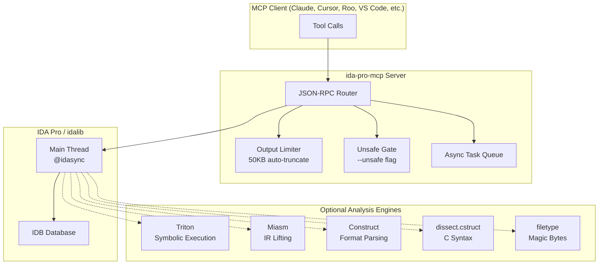

# IDA Pro Binary Analysis MCP

> **One MCP server. Five analysis engines. 120+ tools. Zero configuration overhead.**

Turn IDA Pro into a comprehensive binary analysis powerhouse for AI agents — symbolic execution, IR lifting, deobfuscation, declarative format parsing, stripped-binary reconnaissance, and cross-engine hybrid workflows, all through a single MCP server.

| Engine | Status | Tools |
|--------|--------|-------|
| 🧠 Triton Symbolic Execution | `pip install triton-library` | 30+ |
| 🔬 Miasm IR Analysis | `pip install miasm` | 20+ |
| 📦 Construct Format Parsing | `pip install construct` | 10 |
| 📝 C-Syntax Structs (dissect.cstruct) | `pip install dissect.cstruct` | 7 |
| 🪄 Magic-Byte Identification (filetype) | `pip install filetype` | 4 |
| 🎯 Native IDA (core + recon + hybrid) | Built-in | 60+ |

**All engines are optional.** The plugin runs without any of them; install only what you need.

---

## 🚀 Quick Start

### Windows
```batch
install.bat
```

### Linux / macOS
```bash
chmod +x install.sh
./install.sh
```

The interactive TUI lets you toggle engines with **Space** and confirm with **Enter**:

```
Install optional analysis engines? (space=toggle, enter=confirm):
[✓] Triton    — symbolic execution & SMT constraint solving
[✓] Miasm     — IR lifting, SSA, deobfuscation, cross-arch assembly
[✓] Construct — declarative binary format parsing
[✓] cstruct   — C-syntax struct/enum parsing
[✓] filetype  — magic-byte file type identification
```

### Manual Install
```bash
pip uninstall ida-pro-mcp ida-pro-mcp-xjoker -y
pip install -e .
ida-pro-mcp --install
ida-pro-mcp --install-deps all       # optional engines
```

### Verify
```
triton_status      → {"ok": true, "available": true, ...}
miasm_status       → {"ok": true, "available": true, ...}
construct_status   → {"ok": true, "available": true, ...}
cstruct_status     → {"ok": true, "available": true, ...}
filetype_status    → {"ok": true, "available": true, ...}
```

---

## 🏗️ Architecture



**Execution modes:**
1. **GUI Plugin** — `ida_mcp.py` loads inside IDA Pro, starts HTTP server, writes discovery JSON
2. **Headless Single-Process** — `idalib-mcp --stdio` opens binaries via `idapro` without GUI
3. **Headless Supervisor** — `idalib-mcp --supervise` spawns per-binary workers with `--max-workers N`

---

## 🎯 Capability Matrix

| Capability | Triton | Miasm | Construct | cstruct | filetype | Native |
|-----------|:------:|:-----:|:---------:|:-------:|:--------:|:------:|
| Symbolic execution | ✅ | ⚪ | ⚪ | ⚪ | ⚪ | ⚪ |
| SMT constraint solving | ✅ | ⚪ | ⚪ | ⚪ | ⚪ | ⚪ |
| Taint analysis | ✅ | ⚪ | ⚪ | ⚪ | ⚪ | ⚪ |
| IR lifting / SSA | ⚪ | ✅ | ⚪ | ⚪ | ⚪ | ⚪ |
| Dead-code elimination | ⚪ | ✅ | ⚪ | ⚪ | ⚪ | ⚪ |
| Cross-arch assembly | ⚪ | ✅ | ⚪ | ⚪ | ⚪ | ⚪ |
| PE/ELF header parsing | ⚪ | ⚪ | ✅ | ✅ | ⚪ | ⚪ |
| Protocol parsing (TCP/UDP/DNS/TLS) | ⚪ | ⚪ | ✅ | ⚪ | ⚪ | ⚪ |
| C-syntax struct definitions | ⚪ | ⚪ | ⚪ | ✅ | ⚪ | ⚪ |
| Magic-byte file identification | ⚪ | ⚪ | ⚪ | ⚪ | ✅ | ⚪ |
| VTable candidate scanning | ⚪ | ⚪ | ⚪ | ⚪ | ⚪ | ✅ |
| Indirect call discovery | ⚪ | ⚪ | ⚪ | ⚪ | ⚪ | ✅ |
| Stripped binary recon | ⚪ | ⚪ | ⚪ | ⚪ | ⚪ | ✅ |
| FLIRT signature application | ⚪ | ⚪ | ⚪ | ⚪ | ⚪ | ✅ |
| Byte signature generation | ⚪ | ⚪ | ⚪ | ⚪ | ⚪ | ✅ |

---

## 🎓 Specialized AI Skills

Beyond the raw tool surface, the project ships **12+ focused workflow skills** under `skills/`. Each skill is a mini-playbook that teaches an AI agent how to tackle a specific reverse-engineering scenario — with exact tool calls, decision branches, and report templates.

| Skill | What it does |
|-------|-------------|
| `binary-survey` | One-call triage when you first open a binary — metadata, imports, exports, strings, function triage, anti-debug pattern scan |
| `function-deep-dive` | Systematic single-function analysis — decompile, disasm, CFG, stack frame, xrefs, rename, type, comment |
| `stripped-binary-recovery` | Rebuild semantics from `FUN_xxxx` binaries — FLIRT, prologue scanning, VTables, string xref triage, call-graph hub analysis |
| `triton-symbolic-exec` | Symbolic execution workflows — one-shot analysis, instruction-by-instruction control, taint tracking, branch solving, snapshots |
| `miasm-ir-analysis` | IR lifting, SSA, CFG metrics, dead-code elimination, data-flow tracing, cross-arch assembly |
| `hybrid-deobfuscate` | Cross-engine deobfuscation — Miasm simplify → Triton verify → optional patching |
| `construct-format-parsing` | PE/ELF/protocol parsing, C-syntax structs, magic-byte identification, heuristic guessing |
| `crypto-constant-hunter` | Hunt AES S-boxes, SHA init vectors, MD5 constants, ChaCha20 sigma words, Base64 alphabets |
| `debugger-trace` | Live debugger control — breakpoints, register/memory inspection, anti-debug bypass, dynamic unpacking |
| `api-hook-analysis` | Detect IAT hijacking, inline hooks, VTable hijacking, detours, COM hooking |
| `vuln-hunter-static` | Static vulnerability hunting — buffer overflows, format strings, command injection, integer overflows |
| `idapython` | IDAPython scripting reference — module router, common API idioms, ctree visitors |

Skills are automatically discovered by MCP clients that support the skill directory pattern. Point your client at the `skills/` folder and the AI gains instant expertise for each analysis domain.

---

## 🛠️ Tool Inventory

### 🧠 Triton — Symbolic Execution (`triton_*`)
Requires: `pip install triton-library`

| Tool | What it does |
|------|-------------|
| `triton_status` | Probe availability and context state |
| `triton_init` / `triton_reset` | Initialize or clear symbolic context |
| `triton_symbolize_register` / `triton_symbolize_memory` | Mark registers/memory as attacker-controlled |
| `triton_process_instruction` / `triton_process_function` | Feed IDA bytes into Triton one-by-one or in bulk |
| `triton_get_path_constraints` | List accumulated branch conditions |
| `triton_solve_path_constraints` | Ask Z3 for concrete inputs satisfying constraints |
| `triton_taint_register` / `triton_taint_memory` | Tag data as attacker-influenced |
| `triton_get_taint_summary` | List all tainted registers and memory |
| `triton_snapshot_save` / `triton_snapshot_restore` | Save/restore full symbolic state + instruction trace |
| `triton_replay_instructions` | Manually replay a custom instruction sequence |
| `triton_analyze_function` | **One-shot:** init → symbolize args → process → solve |
| `triton_annotate_function` | Write IDA comments at branch points with path conditions |

### 🔬 Miasm — IR Analysis (`miasm_*`)
Requires: `pip install miasm`

| Tool | What it does |
|------|-------------|
| `miasm_status` / `miasm_init` / `miasm_reset` | Probe, init, or rebuild Machine |
| `miasm_lift_to_ir` / `miasm_lift_function` | Lift bytes or a full function to Miasm IR |
| `miasm_get_ssa` | SSA-transformed IRCFG |
| `miasm_get_cfg_summary` | Blocks, edges, cyclomatic complexity, loops (Tarjan SCC) |
| `miasm_get_cfg_dot` | Graphviz DOT export |
| `miasm_deobfuscate_cfg` | Constant folding + dead-code elimination + simplification |
| `miasm_simplify_block` | Symbolically execute one block, return simplified register state |
| `miasm_trace_data_flow` | Backward slice: where does this register's value come from? |
| `miasm_annotate_data_flow` | Write IDA comments at data-flow origins (`@unsafe`) |
| `miasm_assemble` | Cross-arch assembly to hex bytes |
| `miasm_patch_instruction` | Assemble + patch directly into IDA database (`@unsafe`) |
| `miasm_solve_path_constraints` | Enumerate CFG paths; Z3 solve via Triton when available |

### 📦 Construct — Declarative Parsing (`construct_*`)
Requires: `pip install construct`

| Tool | What it does |
|------|-------------|
| `construct_parse_pe_headers` | Parse DOS/NT/Optional/Section headers |
| `construct_parse_elf_headers` | Parse ELF header, program/section headers |
| `construct_parse_custom_struct` | Safe DSL evaluator (AST whitelist, 256-node cap) |
| `construct_parse_ida_struct` | Bridge: auto-convert IDA struct → Construct template |
| `construct_build_struct` | Serialize dict → bytes; optionally patch IDA |
| `construct_guess_struct` | Heuristic auto-guess layout (strings, pointers, padding) |
| `construct_extract_protocol_header` | IPv4, TCP, UDP, ICMP, Ethernet, DNS, TLS |
| `construct_batch_parse_array` | Parse consecutive struct instances (tables) |
| `construct_scan_for_structs` | Scan region for all occurrences of a pattern |

### 📝 dissect.cstruct — C-Syntax Structs (`cstruct_*`)
Requires: `pip install dissect.cstruct`

| Tool | What it does |
|------|-------------|
| `cstruct_parse_c_definition` | Load C-syntax struct/enum/typedef into registry |
| `cstruct_parse_at_address` | Parse IDA memory as named struct |
| `cstruct_parse_ida_struct` | Bridge: convert IDA struct → C definition → parse |
| `cstruct_to_bytes` | Serialize field-value dict back to raw bytes |
| `cstruct_list_defined_structs` | List registered structs (pre-built + user-defined) |

**Pre-built templates:** `IMAGE_DOS_HEADER`, `IMAGE_NT_HEADERS32/64`, `IMAGE_SECTION_HEADER`, `Elf32/64_Ehdr/Phdr/Shdr`, `ip_header`, `tcp_header`, `udp_header`, `ethernet_header`, and more.

### 🪄 filetype — Magic-Byte ID (`filetype_*`)
Requires: `pip install filetype`

| Tool | What it does |
|------|-------------|
| `filetype_identify_buffer` | Identify format from hex bytes or IDA address |
| `filetype_identify_ida_segment` | Identify file type of current binary or segment |
| `filetype_list_supported` | List 79+ detectable types by category |

### 🎯 Native IDA — Reconnaissance (`api_recon.py`)
No extra dependencies.

| Tool | What it does |
|------|-------------|
| `get_binary_sections` | Enumerate segments with permissions, bitness, type |
| `find_vtable_candidates` | Scan for consecutive executable pointer arrays (VTable DNA) |
| `find_indirect_calls` | Find `call [reg+offset]` with offset histogram |
| `identify_vtable_call` | Back-trace indirect call to object-loading chain |
| `find_global_writers` | Find all instructions writing to a global |
| `analyze_cleanup_function` | Mine Release() offsets to infer struct layout |
| `find_function_prologues` | Scan for x64/x86 prologues; optionally create functions (`@unsafe`) |

### ⚡ Hybrid — Cross-Engine Workflows (`hybrid_*`)
Requires both Triton and Miasm.

| Tool | What it does |
|------|-------------|
| `hybrid_analyze_function` | Miasm deobfuscation → Triton symbolic execution → Z3 solve |
| `hybrid_deobfuscate_and_patch` | Miasm DCE → identify dead blocks → optionally NOP-patch (`@unsafe`) |
| `hybrid_iterative_deobfuscate` | Iterative simplification → Triton verification → patch → repeat (`@unsafe`) |

### 🔄 Async Tasks (`task_*`)
Submit heavy operations to avoid MCP client timeouts.

| Tool | What it does |
|------|-------------|
| `task_submit` | Submit any tool as a background task → `task_id` |
| `task_poll` | Poll status + progress → result when `done` |
| `task_list` | List active/recent tasks with auto-detected category |
| `task_cancel` | Cancel pending tasks |

---

## 🗺️ Example Workflows

### Workflow 1: Obfuscated Function Recovery
```
survey_binary(detail_level="minimal")
  ↓
hybrid_iterative_deobfuscate(address="0x401000", dry_run=True)
  ↓
hybrid_analyze_function(address="0x401000", symbolize_args=True)
  ↓
triton_annotate_function(address="0x401000")
```

### Workflow 2: Stripped Binary Reconnaissance
```
get_binary_sections()
  ↓
find_function_prologues(start="0x140000000", end="0x140010000", create=True)
  ↓
find_vtable_candidates(section=".data", min_pointers=4)
  ↓
find_indirect_calls(start="0x140001000", end="0x140005000")
  ↓
apply_flirt_signature(sig_name="vc64rtf")
```

### Workflow 3: Protocol Structure Extraction
```
filetype_identify_buffer(address="0x405000", size=256)
  ↓
construct_extract_protocol_header(protocol="tcp", address="0x405000")
  ↓
cstruct_define_struct(name="CustomHeader", c_definition="...")
  ↓
cstruct_parse_at_address(struct_name="CustomHeader", address="0x405014")
```

### Workflow 4: Symbolic Exploit Path Finding
```
triton_init()
  ↓
triton_symbolize_register(register="rdi", alias="user_input")
  ↓
triton_process_function(address="0x401230", max_insns=500)
  ↓
triton_get_path_constraints()
  ↓
triton_solve_path_constraints(timeout_ms=30000)
```

### Workflow 5: Encrypted Section Unpacking
For packed/encrypted sections where IDA skipped auto-analysis.
```
# 1. Run the target in IDA's debugger until the decryption stub completes
dbg_run_to(address="0x412000")     # run to post-decrypt point
  ↓
# 2. Sync live decrypted bytes from the debugger into the IDB
sync_debugger_to_idb(start="0x401000", end="0x412000", analyze=True)
  ↓
# 3. Create IDA functions for all newly disassembled code
scan_and_define_funcs(start="0x401000", end="0x412000", force=True)
  ↓
# 4. Query cross-references — they now resolve correctly
xrefs_to(addr="0x4010A0")
  ↓
# 5. For indirect/obfuscated calls, add explicit xrefs
add_xref([{"from": "0x4011F2", "to": "0x4010A0", "type": "call"}])
```

---

## 📋 Prerequisites

- [Python](https://www.python.org/downloads/) **3.11+**
- [IDA Pro](https://hex-rays.com/ida-pro) **8.3+** (9.x recommended) — IDA Free is **not supported**
- Any [MCP Client](https://modelcontextprotocol.io/clients#example-clients): Claude, Cursor, Roo Code, VS Code, etc.

Run `ida-pro-mcp --config` to generate a JSON config for your specific client.

---

## 🔌 MCP Client Configuration

### Auto-install to your IDE
```bash
ida-pro-mcp --install roo          # project-level
ida-pro-mcp --install claude --scope global
```

### Export JSON configs (recommended for manual control)
```bash
ida-pro-mcp --install cursor,claude --scope export --transport streamable-http
```

### Manual JSON
```json
{
  "mcpServers": {
    "ida-pro-mcp": {
      "command": "ida-pro-mcp"
    }
  }
}
```

---

## 🖥️ Transports & Headless Mode

### GUI Plugin with SSE transport
```bash
uv run ida-pro-mcp --transport http://127.0.0.1:8744/sse
```

### Headless stdio (for Claude Code, Roo, etc.)
```bash
uv run idalib-mcp --stdio path/to/binary
```

### Headless HTTP with multi-database support
```bash
uv run idalib-mcp --host 127.0.0.1 --port 8745 --max-workers 4
```

### Context isolation (multi-agent safe)
```bash
uv run idalib-mcp --isolated-contexts --stdio
```

Dynamic database management in headless mode:
```python
idalib_open("/path/to/binary_a.exe", session_id="binary_a")
idalib_open("/path/to/library.dll", session_id="library")

decompile("main", database="binary_a")
xrefs_to("ImportantExport", database="library")
```

_Note:_ Headless `idalib-mcp` requires [idalib](https://docs.hex-rays.com/core/idalib/getting-started) activation and [uv](https://astral.sh/uv).

---

## 📡 MCP Resources

**Core IDB State:**
- `ida://idb/metadata` — file info, arch, base, size, hashes
- `ida://idb/segments` — memory segments with RWX permissions
- `ida://idb/entrypoints` — main, TLS callbacks

**Triton Session State:**
- `triton://session/context` — full context dump
- `triton://session/constraints` — path predicate in SMT-LIB 2
- `triton://session/symbolic-vars` — symbolic variable listing

**Miasm Function State:**
- `miasm://function/{address}/ir` — IRCFG JSON
- `miasm://function/{address}/ssa` — SSA-form IRCFG
- `miasm://function/{address}/cfg-dot` — Graphviz DOT

---

## 🧩 Core API Quick Reference

| Category | Key Tools |
|----------|-----------|
| **Metadata** | `lookup_funcs`, `list_funcs`, `list_globals`, `imports`, `server_health`, `survey_binary` |
| **Analysis** | `decompile`, `disasm`, `basic_blocks`, `callgraph`, `analyze_funcs`, `func_profile` |
| **Search** | `find_bytes`, `find_immediate`, `find_regex`, `search_text`, `scan_signature` |
| **Memory** | `get_bytes`, `get_int`, `get_string`, `get_global_value`, `patch`, `put_int` |
| **Types** | `declare_type`, `apply_type_batch`, `infer_type`, `read_struct`, `search_structs` |
| **Mutation** | `rename`, `set_comments`, `patch_asm`, `define_func`, `define_code`, `undefine`, `add_xref` |
| **Analysis control** | `analyze_range`, `scan_and_define_funcs` |
| **Stack** | `stack_frame`, `declare_stack`, `delete_stack` |
| **Signatures** | `make_signature`, `scan_signature`, `apply_flirt_signature`, `load_type_library` |
| **Python** | `py_eval`, `py_exec_file` (`@unsafe`) |
| **Debugger** | `dbg_start`, `dbg_run_to`, `dbg_add_bp`, `dbg_regs`, `dbg_stacktrace`, `sync_debugger_to_idb` (`?ext=dbg`) |

**Design principles:**
- ✅ **Structured returns** — every tool returns `{"ok": true/false, ...}`
- ✅ **String addresses** — pass `"0x401000"` or `"main"`, never convert manually
- ✅ **Batch-first** — most APIs accept lists or comma-separated strings
- ✅ **Pagination** — search results use cursor-based pagination (limit 1000, max 10000)
- ✅ **Output limiting** — >50KB outputs auto-truncate with download URLs

---

## 💡 Prompt Engineering Tips

### Minimal crackme prompt
```md
Your task is to analyze a crackme in IDA Pro using the MCP tools.

Strategy:
- Inspect decompilation and add comments with findings
- Rename variables and functions to sensible names
- Correct pointer/array types where necessary
- Disassemble for low-level details when needed
- NEVER convert number bases yourself — use `int_convert`
- Do not brute force; derive solutions from analysis
- Create a report.md with findings
```

### Comprehensive RE prompt (by [@can1357](https://github.com/can1357))
```md
Your task is to create a complete reverse engineering analysis.

1. **Decompilation Analysis** — inspect thoroughly, add comments
2. **Improve Readability** — rename vars/functions, fix types
3. **Deep Dive** — disassemble when needed, document low-level behavior
4. **Constraints** — use `int_convert`, derive conclusions from evidence
5. **Documentation** — produce comprehensive RE/*.md files
```

### Obfuscated binary workflow
```md
For obfuscated binaries, follow this sequence:
1. hybrid_iterative_deobfuscate(dry_run=True) → see dead blocks
2. hybrid_iterative_deobfuscate(dry_run=False, confirm=True) → apply NOPs
3. hybrid_analyze_function(symbolize_args=True) → symbolic report
4. miasm_solve_path_constraints → find inputs reaching target blocks
```

---

## 🛠️ Development

Adding a new tool is one function in `src/ida_pro_mcp/ida_mcp/api_*.py`:

```python
from .rpc import tool
from .sync import idasync

@tool
@idasync
def my_new_tool(address: Annotated[str, "Target address (hex or symbol)"]) -> dict:
    """One-sentence description for AI agents."""
    ea = parse_address(address)
    ...
    return {"ok": True, "result": ...}
```

No additional boilerplate required.

### Test the MCP server
```bash
npx -y @modelcontextprotocol/inspector   # opens http://localhost:5173
```

### Run IDA-side tests
```bash
uv run ida-mcp-test tests/crackme03.elf -q
uv run ida-mcp-test tests/typed_fixture.elf -q
```

### Coverage
```bash
uv run coverage erase
uv run coverage run -m ida_pro_mcp.test tests/crackme03.elf -q
uv run coverage run --append -m ida_pro_mcp.test tests/typed_fixture.elf -q
uv run coverage report --show-missing
```

---

## 🔮 Roadmap

The project is actively evolving. Here's what's on the horizon:

### Phase 4 — Surgical Analysis & Workflow Automation *(in progress)*

**Smarter recovery from stripped binaries.** After FLIRT signatures run, the plugin will auto-suggest names for the remaining unnamed functions by scoring prologue matches, cross-reference patterns, and structural similarity — turning hours of manual triage into a ranked candidate list.

**Type propagation chains.** Starting from a single `malloc` call, the engine will trace forward through field writes and pointer assignments to auto-infer complete struct layouts — no more guessing what lives at offset `0x18`.

**Batch deobfuscation.** Instead of cleaning one function at a time, point the tool at an entire segment (`.text`, `.itext`) and let it automatically identify obfuscated functions, run iterative Miasm simplification, and NOP out dead code — converging on clean assembly without manual intervention.

**Multi-hop xref archaeology.** Trace data flow across function boundaries, through call chains, and into global variables. Follow a tainted register from `main` all the way to the `recv` call that populates it — hop by hop, with full edge classification.

### Phase 5 — Scientific Computing & Advanced Binary Intelligence *(planned)*

**Entropy heatmaps.** Visualize which regions of a binary are encrypted, compressed, or plaintext — computed numerically across the entire image, not just the sections IDA knows about.

**Graph-theoretic RE.** Run PageRank on the call graph to find the "most important" functions. Use community detection to auto-partition a malware binary into its crypto, networking, and anti-analysis modules. Find critical bridges whose removal would disconnect entire subsystems.

**Signal processing for crypto detection.** Apply FFT and spectral analysis to binary data to detect periodic patterns — AES S-box tables, repeated XOR keys, and encoded C2 domains reveal themselves as frequency spikes.

**YARA signature scanning.** Built-in rules for malware families (Cobalt Strike, Metasploit, Mimikatz), crypto constants, and packer stubs — scan the entire binary in milliseconds without writing a single rule.

**Binary format surgery.** Add sections, patch imports, rebuild headers, and strip debug metadata — all through a unified cross-format API. Inject a TLS callback for testing, or remove a rich header to neutralize build-environment leaks.

**Exploit primitives.** Generate cross-architecture shellcode, build cyclic De Bruijn patterns for offset calculation, enumerate ROP gadgets, and pack/unpack integers with configurable endianness — directly inside the IDA context.

---

## 📜 License & Attribution

This project is a fork of [mrexodia/ida-pro-mcp](https://github.com/mrexodia/ida-pro-mcp). Upstream core IDA tools, zeromcp transport, and idalib support are from that project.

### Project License

The `ida-pro-triton-miasm-mcp` plugin and server code itself retains the same license as upstream. See the `LICENSE` file in the repository root for the exact terms.

### Third-Party Engine Licenses

The following optional analysis engines are **not** bundled with this project. They are installed separately by the user via `pip` and loaded dynamically at runtime. This project does not modify their source code.

| Engine | PyPI Package | License |
|--------|-------------|---------|
| Triton | `triton-library` | [Apache-2.0](https://github.com/JonathanSalwan/Triton/blob/master/LICENSE) |
| Miasm | `miasm` | [GPL-2.0](https://github.com/cea-sec/miasm) |
| Construct | `construct` | [MIT](https://github.com/construct/construct) |
| dissect.cstruct | `dissect.cstruct` | [Apache-2.0](https://github.com/fox-it/dissect.cstruct/blob/main/LICENSE) |
| filetype | `filetype` | [MIT](https://github.com/h2non/filetype.py) |

> **Note:** Miasm is licensed under GPL-2.0. Because this project loads Miasm as an unmodified, independently-installed optional dependency (dynamic import at runtime, no source modification, no static linking), the GPL-2.0 terms apply to Miasm itself and any derivative works of Miasm, but do not extend to this plugin or to the user's own analysis scripts. If you redistribute a modified version of Miasm itself, GPL-2.0 obligations would apply to that modification.
>
