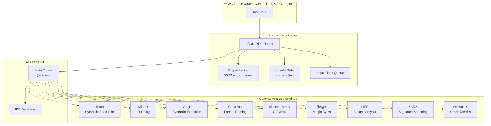

# Synapse MCP

> **One MCP server. Nine analysis engines. 250+ tools. Zero configuration overhead.**

A synapse is not a wire. It is a gap — a microscopic, dynamic space that only conducts a signal when the moment demands it. Your brain does not fire every neuron to brush your teeth; it activates exactly the motor pathways required, then returns to quiet. **Synapse MCP** applies the same principle to binary analysis: nine distinct engines and over two hundred and fifty tools exist in the server, but only the ones relevant to the current task ever cross into the agent's context window.

Drop a packed PE onto IDA and the *static* synapses ignite first — LIEF maps the headers, YARA scans for signatures, NetworkX traces the call graph — giving the agent a structural blueprint without ever loading a symbolic solver. Hit an encrypted VM stub and the system dynamically bridges to the *heavy* synapses: Triton builds path constraints, Miasm lifts the obfuscated IR, and angr explores the reachable state space. When the puzzle is solved, those pathways fade back to idle. The agent never carries the cognitive weight of all nine engines at once.

This is not a monolithic "powerhouse" that blasts every capability into memory regardless of need. It is a digital nervous system: situational, adaptive, and ruthlessly efficient. Lazy profiles route each signal to the right synapse, so the context window stays clean for thinking — not cataloging.

| Engine | Status | Tools |
|--------|--------|-------|
| 🧠 Triton Symbolic Execution | `pip install triton-library` | 51 |
| 🔬 Miasm IR Analysis | `pip install miasm` | 21 |
| 🐍 Angr Symbolic Execution | `pip install angr` | 22 |
| 📦 Construct Format Parsing | `pip install construct` | 10 |
| 📝 C-Syntax Structs (dissect.cstruct) | `pip install dissect.cstruct` | 7 |
| 🪄 Magic-Byte Identification (filetype) | `pip install filetype` | 4 |
| 🔍 LIEF Binary Analysis | `pip install lief` | 19 |
| 🎯 YARA Signature Scanning | `pip install yara-python` | 11 |
| 🕸️ NetworkX Graph Metrics | `pip install networkx>=3.0` | 24 |
| 🛡️ Native IDA (core + recon + hybrid) | Built-in | 124 |

**All engines are optional.** The plugin runs without any of them; install only what you need.

---

## 🦥 Lazy Mode — 95% Less Context, Same Power

AI agents have a dirty secret: every MCP session starts by loading **all 250+ tool schemas** into context. That's 24,000–48,000 tokens burned before a single analysis step. For agents with 64K or 128K context windows, this leaves almost no room for the actual work — decompilation, symbolic execution, cross-references.

**Lazy mode fixes this.** Start the server with `--lazy` and `tools/list` returns only **4 meta-tools**:

| Meta-Tool | What it does |
|-----------|-------------|
| `list_modules` | Discover 6 semantic groups with live tool counts and representative tool names embedded directly in the description |
| `list_tools(module=..., search=..., limit=50, offset=0)` | Browse a group or search by keyword across all groups |
| `describe_tool(name)` | Load the full schema for one tool on demand |
| `invoke_tool(tool, args)` | Execute any tool by name |

The agent pays only **~800 tokens** at session start. When it needs Triton, it asks for the `symbolic` group. When it needs to rename a function, it asks for `modify`. Schemas are fetched just-in-time and cached automatically. If IDA reloads a new binary mid-session, the cache self-invalidates and retries transparently.

```bash
ida-pro-mcp --lazy          # GUI plugin mode
idalib-mcp --stdio --lazy   # Headless mode
```

### Optimized for Minimal Round-Trips

The lazy mode implementation goes beyond simple deferral — it is engineered to minimize how much context an agent consumes *getting to the tool call*:

**Embedded group directory.** The `list_modules` description field contains a live-generated directory of all six groups: their current tool counts and the most representative tool names in each. Agents that already know what they want (e.g. `decompile`, `rename`, `triton_init`) can skip `list_modules` entirely and call `invoke_tool` directly. **Zero discovery overhead.**

**Keyword search across all groups.** `list_tools(search='crackme')` returns every tool whose name or description contains that term — across all groups — in a single call. No browsing, no group-by-group iteration. One call to find the right tool, one call to use it.

**Cheapest-first discovery paths:**
1. **Know the name** → `invoke_tool` directly *(0 discovery calls)*
2. **Know a keyword** → `list_tools(search='keyword')` → `invoke_tool` *(1 call)*
3. **Know the group** → `list_tools(module='analysis')` → `invoke_tool` *(1 call)*
4. **Exploring** → `list_modules` → `list_tools(module=...)` → `invoke_tool` *(2 calls)*

Lazy mode is the default we recommend for Claude, Roo, Cursor, and any client where context is precious. For agents with very large windows (200K+), run without `--lazy` to get all tools upfront.

---

## 🚀 Quick Start

### Windows
```batch
install.bat
```

### Linux / macOS
```bash
chmod +x install.sh
./install.sh
```

The interactive TUI lets you toggle engines with **Space** and confirm with **Enter**:

```
Install optional analysis engines? (space=toggle, enter=confirm):
[✓] Triton    — symbolic execution & SMT constraint solving
[✓] Miasm     — IR lifting, SSA, deobfuscation, cross-arch assembly
[✓] Construct — declarative binary format parsing
[✓] cstruct   — C-syntax struct/enum parsing
[✓] filetype  — magic-byte file type identification
[✓] lief      — binary format analysis, checksec, signatures
[✓] yara      — signature scanning, threat detection, IDB annotation
```

### Manual Install
```bash
pip uninstall ida-pro-mcp ida-pro-mcp-xjoker -y
pip install -e .
ida-pro-mcp --install
ida-pro-mcp --install-deps all       # optional engines
```

### Verify
```
triton_status      → {"ok": true, "available": true, ...}
miasm_status       → {"ok": true, "available": true, ...}
angr_status        → {"ok": true, "available": true, ...}
construct_status   → {"ok": true, "available": true, ...}
cstruct_status     → {"ok": true, "available": true, ...}
filetype_status    → {"ok": true, "available": true, ...}
lief_status        → {"ok": true, "available": true, "version": "0.17.x", ...}
yara_status        → {"ok": true, "available": true, ...}
nx_status          → {"ok": true, "available": true, ...}
```

---

## 🏗️ Architecture



**Execution modes:**
1. **GUI Plugin** — `ida_mcp.py` loads inside IDA Pro, starts HTTP server, writes discovery JSON
2. **Headless Single-Process** — `idalib-mcp --stdio` opens binaries via `idapro` without GUI
3. **Headless Supervisor** — `idalib-mcp --supervise` spawns per-binary workers with `--max-workers N`

---

## 🎯 Capability Matrix

| Capability | Triton | Miasm | Angr | Construct | cstruct | filetype | LIEF | Native |
|-----------|:------:|:-----:|:----:|:---------:|:-------:|:--------:|:----:|:------:|
| Symbolic execution | ✅ | ⚪ | ✅ | ⚪ | ⚪ | ⚪ | ⚪ | ⚪ |
| SMT constraint solving | ✅ | ⚪ | ✅ | ⚪ | ⚪ | ⚪ | ⚪ | ⚪ |
| Taint analysis | ✅ | ⚪ | ⚪ | ⚪ | ⚪ | ⚪ | ⚪ | ⚪ |
| IR lifting / SSA | ⚪ | ✅ | ⚪ | ⚪ | ⚪ | ⚪ | ⚪ | ⚪ |
| Dead-code elimination | ⚪ | ✅ | ⚪ | ⚪ | ⚪ | ⚪ | ⚪ | ⚪ |
| Cross-arch assembly | ⚪ | ✅ | ⚪ | ⚪ | ⚪ | ⚪ | ⚪ | ⚪ |
| CFG recovery (static) | ⚪ | ✅ | ✅ | ⚪ | ⚪ | ⚪ | ⚪ | ⚪ |
| Stdin/argv symbolic modeling | ⚪ | ⚪ | ✅ | ⚪ | ⚪ | ⚪ | ⚪ | ⚪ |
| Backward slicing | ⚪ | ⚪ | ✅ | ⚪ | ⚪ | ⚪ | ⚪ | ⚪ |
| PE/ELF header parsing | ⚪ | ⚪ | ⚪ | ✅ | ✅ | ⚪ | ✅ | ⚪ |
| Protocol parsing (TCP/UDP/DNS/TLS) | ⚪ | ⚪ | ⚪ | ✅ | ⚪ | ⚪ | ⚪ | ⚪ |
| C-syntax struct definitions | ⚪ | ⚪ | ⚪ | ⚪ | ✅ | ⚪ | ⚪ | ⚪ |
| Magic-byte file identification | ⚪ | ⚪ | ⚪ | ⚪ | ⚪ | ✅ | ⚪ | ⚪ |
| Authenticode / cert chain verification | ⚪ | ⚪ | ⚪ | ⚪ | ⚪ | ⚪ | ✅ | ⚪ |
| Rich Header compiler fingerprinting | ⚪ | ⚪ | ⚪ | ⚪ | ⚪ | ⚪ | ✅ | ⚪ |
| CFG guard table analysis | ⚪ | ⚪ | ⚪ | ⚪ | ⚪ | ⚪ | ✅ | ⚪ |
| Overlay / packer detection | ⚪ | ⚪ | ⚪ | ⚪ | ⚪ | ⚪ | ✅ | ⚪ |
| Raw-file vs IDB diff | ⚪ | ⚪ | ⚪ | ⚪ | ⚪ | ⚪ | ✅ | ⚪ |
| Section / import surgery | ⚪ | ⚪ | ⚪ | ⚪ | ⚪ | ⚪ | ✅ | ⚪ |
| Security mitigations (checksec) | ⚪ | ⚪ | ⚪ | ⚪ | ⚪ | ⚪ | ✅ | ⚪ |
| VTable candidate scanning | ⚪ | ⚪ | ⚪ | ⚪ | ⚪ | ⚪ | ⚪ | ✅ |
| Indirect call discovery | ⚪ | ⚪ | ⚪ | ⚪ | ⚪ | ⚪ | ⚪ | ✅ |
| Stripped binary recon | ⚪ | ⚪ | ⚪ | ⚪ | ⚪ | ⚪ | ⚪ | ✅ |
| FLIRT signature application | ⚪ | ⚪ | ⚪ | ⚪ | ⚪ | ⚪ | ⚪ | ✅ |
| Byte signature generation | ⚪ | ⚪ | ⚪ | ⚪ | ⚪ | ⚪ | ⚪ | ✅ |
| Call-graph analysis | ⚪ | ⚪ | ⚪ | ⚪ | ⚪ | ⚪ | ⚪ | ✅ |
| CFG metrics / dominators | ⚪ | ⚪ | ⚪ | ⚪ | ⚪ | ⚪ | ⚪ | ✅ |
| Community detection | ⚪ | ⚪ | ⚪ | ⚪ | ⚪ | ⚪ | ⚪ | ✅ |
| Graph diff / ROP gadget graph | ⚪ | ⚪ | ⚪ | ⚪ | ⚪ | ⚪ | ⚪ | ✅ |

---

## 🎓 Specialized AI Skills

Beyond the raw tool surface, the project ships **13+ focused workflow skills** under `skills/`. Each skill is a mini-playbook that teaches an AI agent how to tackle a specific reverse-engineering scenario — with exact tool calls, decision branches, and report templates.

| Skill | What it does |
|-------|-------------|
| `binary-survey` | One-call triage when you first open a binary — metadata, imports, exports, strings, function triage, anti-debug pattern scan |
| `function-deep-dive` | Systematic single-function analysis — decompile, disasm, CFG, stack frame, xrefs, rename, type, comment |
| `stripped-binary-recovery` | Rebuild semantics from `FUN_xxxx` binaries — FLIRT, prologue scanning, VTables, string xref triage, call-graph hub analysis |
| `triton-symbolic-exec` | Symbolic execution workflows — one-shot analysis, instruction-by-instruction control, taint tracking, branch solving, snapshots |
| `angr-symbolic-exec` | Symbolic path exploration workflows — stdin/argv modeling, crackme solving, CFG recovery, backward slicing, snapshot management |
| `miasm-ir-analysis` | IR lifting, SSA, CFG metrics, dead-code elimination, data-flow tracing, cross-arch assembly |
| `hybrid-deobfuscate` | Cross-engine deobfuscation — Miasm simplify → Triton verify → optional patching |
| `construct-format-parsing` | PE/ELF/protocol parsing, C-syntax structs, magic-byte identification, heuristic guessing |
| `crypto-constant-hunter` | Hunt AES S-boxes, SHA init vectors, MD5 constants, ChaCha20 sigma words, Base64 alphabets |
| `debugger-trace` | Live debugger control — breakpoints, register/memory inspection, anti-debug bypass, dynamic unpacking |
| `api-hook-analysis` | Detect IAT hijacking, inline hooks, VTable hijacking, detours, COM hooking |
| `vuln-hunter-static` | Static vulnerability hunting — buffer overflows, format strings, command injection, integer overflows |
| `idapython` | IDAPython scripting reference — module router, common API idioms, ctree visitors |

Skills are automatically discovered by MCP clients that support the skill directory pattern. Point your client at the `skills/` folder and the AI gains instant expertise for each analysis domain.

---

## 🛠️ Tool Inventory

### 🧠 Triton — Symbolic Execution (`triton_*`)
Requires: `pip install triton-library`

| Tool | What it does |
|------|-------------|
| `triton_status` | Probe availability and context state |
| `triton_init` / `triton_reset` | Initialize or clear symbolic context |
| `triton_symbolize_register` / `triton_symbolize_memory` | Mark registers/memory as attacker-controlled |
| `triton_process_instruction` / `triton_process_function` | Feed IDA bytes into Triton one-by-one or in bulk |
| `triton_get_path_constraints` | List accumulated branch conditions |
| `triton_solve_path_constraints` | Ask Z3 for concrete inputs satisfying constraints |
| `triton_taint_register` / `triton_taint_memory` | Tag data as attacker-influenced |
| `triton_get_taint_summary` | List all tainted registers and memory |
| `triton_snapshot_save` / `triton_snapshot_restore` | Save/restore full symbolic state + instruction trace |
| `triton_replay_instructions` | Manually replay a custom instruction sequence |
| `triton_analyze_function` | **One-shot:** init → symbolize args → process → solve |
| `triton_annotate_function` | Write IDA comments at branch points with path conditions |

### 🔬 Miasm — IR Analysis (`miasm_*`)
Requires: `pip install miasm`

| Tool | What it does |
|------|-------------|
| `miasm_status` / `miasm_init` / `miasm_reset` | Probe, init, or rebuild Machine |
| `miasm_lift_to_ir` / `miasm_lift_function` | Lift bytes or a full function to Miasm IR |
| `miasm_get_ssa` | SSA-transformed IRCFG |
| `miasm_get_cfg_summary` | Blocks, edges, cyclomatic complexity, loops (Tarjan SCC) |
| `miasm_get_cfg_dot` | Graphviz DOT export |
| `miasm_deobfuscate_cfg` | Constant folding + dead-code elimination + simplification |
| `miasm_simplify_block` | Symbolically execute one block, return simplified register state |
| `miasm_trace_data_flow` | Backward slice: where does this register's value come from? |
| `miasm_annotate_data_flow` | Write IDA comments at data-flow origins (`@unsafe`) |
| `miasm_assemble` | Cross-arch assembly to hex bytes |
| `miasm_patch_instruction` | Assemble + patch directly into IDA database (`@unsafe`) |
| `miasm_solve_path_constraints` | Enumerate CFG paths; Z3 solve via Triton when available |

### 🐍 Angr — Symbolic Execution (`angr_*`)  ⚠️ Known Issues / TBD
Requires: `pip install angr` (~200 MB; NOT included in `--install-deps all`)

> **Status (2026-05-22):** Several known issues fixed in the latest patch — `SpillingCFG.neighbors()` replaced with manual BFS, the `CFGFast` generator `len()` error resolved, and the claripy SIGINT handler assertion hardened with a three-layer patch (module-level no-ops + counter reset + class-method patch) plus a runtime retry guard that re-applies the patch and retries if an assertion still fires mid-exploration. These fixes have **not yet been stress-tested** on a broad set of binaries; treat this module as **experimental** until a dedicated regression pass confirms stability. Report issues.

**Status probe** (always available, even without angr installed):

| Tool | What it does |
|------|-------------|
| `angr_status` | Probe angr availability, version, and engine flags |

**Core — Load & CFG:**

| Tool | What it does |
|------|-------------|
| `angr_load_segment` | Load binary into a cached angr Project (LRU eviction, max 3) |
| `angr_cfg_fast` | Static CFG via CFGFast — functions, blocks, edges, indirect jumps |
| `angr_cfg_from_ida` | Build CFG from IDA's FlowChart for a single function |
| `angr_diff_cfg` | Compare IDA FlowChart vs angr CFGFast block-by-block |

**Core — Symbolic Execution:**

| Tool | What it does |
|------|-------------|
| `angr_find_paths` ⭐ | **KILLER FEATURE** — solve for stdin/argv/register inputs that reach a target address |
| `angr_enumerate_reachable` | BFS reachable addresses from a source over the CFG |
| `angr_state_evaluate` | Evaluate register/arithmetic/memory expression at a blank state |
| `angr_hook_function` | Skip, observe, or unhook SimProcedures during symbolic execution |

**Core — Analysis:**

| Tool | What it does |
|------|-------------|
| `angr_backward_slice` | Data-flow origin of a register (CFG-only fast or DDG-backed precise) |
| `angr_value_set` | Register value bounds (min/max) at a program point |
| `angr_snapshot_save` / `angr_snapshot_restore` | Save/restore SimState snapshots |

**Hybrid — Cross-Engine:**

| Tool | What it does |
|------|-------------|
| `hybrid_angr_triton_solve` | angr finds the path → Triton enriches with deep register-level state |
| `hybrid_angr_stdin_fuzz` | Char-class-constrained stdin enumeration (multiple distinct inputs) |
| `hybrid_angr_miasm_path` | Miasm deobfuscation context → angr solve |
| `hybrid_angr_triton_decompile` | Decompile + annotate with symbolic register state |
| `hybrid_angr_z3_formula` | Export path constraints as SMT-LIB2 for external verification |

**Workflows — High-Level:**

| Tool | What it does |
|------|-------------|
| `workflow_solve_crackme` ⭐ | One-call end-to-end serial-key solver (auto-detects success/fail strings) |
| `workflow_trace_data_flow` | Cross-function backward data-flow trace (slice + IDA xrefs) |
| `workflow_find_gadgets` | ROP/JOP gadget enumeration in a segment |
| `workflow_enum_code_hints` | Path constraint hints — which bytes are fixed across all paths |

### 📦 Construct — Declarative Parsing (`construct_*`)
Requires: `pip install construct`

| Tool | What it does |
|------|-------------|
| `construct_parse_pe_headers` | Parse DOS/NT/Optional/Section headers |
| `construct_parse_elf_headers` | Parse ELF header, program/section headers |
| `construct_parse_custom_struct` | Safe DSL evaluator (AST whitelist, 256-node cap) |
| `construct_parse_ida_struct` | Bridge: auto-convert IDA struct → Construct template |
| `construct_build_struct` | Serialize dict → bytes; optionally patch IDA |
| `construct_guess_struct` | Heuristic auto-guess layout (strings, pointers, padding) |
| `construct_extract_protocol_header` | IPv4, TCP, UDP, ICMP, Ethernet, DNS, TLS |
| `construct_batch_parse_array` | Parse consecutive struct instances (tables) |
| `construct_scan_for_structs` | Scan region for all occurrences of a pattern |

### 📝 dissect.cstruct — C-Syntax Structs (`cstruct_*`)
Requires: `pip install dissect.cstruct`

| Tool | What it does |
|------|-------------|
| `cstruct_parse_c_definition` | Load C-syntax struct/enum/typedef into registry |
| `cstruct_parse_at_address` | Parse IDA memory as named struct |
| `cstruct_parse_ida_struct` | Bridge: convert IDA struct → C definition → parse |
| `cstruct_to_bytes` | Serialize field-value dict back to raw bytes |
| `cstruct_list_defined_structs` | List registered structs (pre-built + user-defined) |

**Pre-built templates:** `IMAGE_DOS_HEADER`, `IMAGE_NT_HEADERS32/64`, `IMAGE_SECTION_HEADER`, `Elf32/64_Ehdr/Phdr/Shdr`, `ip_header`, `tcp_header`, `udp_header`, `ethernet_header`, and more.

### 🪄 filetype — Magic-Byte ID (`filetype_*`)
Requires: `pip install filetype`

| Tool | What it does |
|------|-------------|
| `filetype_identify_buffer` | Identify format from hex bytes or IDA address |
| `filetype_identify_ida_segment` | Identify file type of current binary or segment |
| `filetype_list_supported` | List 79+ detectable types by category |

### 🔍 LIEF — Binary Analysis (`lief_*`, `hybrid_lief_*`)
Requires: `pip install lief`

**Status probe** (always available, even without lief installed):

| Tool | What it does |
|------|-------------|
| `lief_status` | Probe LIEF version and extended-tier availability |

**Core analysis — PE, ELF, Mach-O:**

| Tool | What it does |
|------|-------------|
| `lief_info` | Format, arch, bits, entry point, image base, section/import/export counts |
| `lief_checksec` | NX, ASLR, CFG, SafeSEH, Authenticode (PE); RELRO, canary, PIE (ELF); numeric score |
| `lief_sections` | All sections with entropy, permissions, optional content preview |
| `lief_imports` | Imported DLLs + functions with IAT addresses, ordinals, C++ demangling; delay imports |
| `lief_exports` | Exported symbols with ordinals, forwarding chains, demangled names |
| `lief_strings` | ASCII + UTF-16LE string extraction across sections and PE overlay |

**PE-specific killers:**

| Tool | What it does |
|------|-------------|
| `lief_tls_callbacks` ⭐ | TLS callback addresses + IDA names — common anti-debug entry point |
| `lief_verify_signature` ⭐ | Full Authenticode verification: cert chain, authentihash compare, countersignature timestamp |
| `lief_rich_header` ⭐ | Decode Rich Header: VS component IDs, build numbers, compiler-version guess, SHA-256 fingerprint |
| `lief_pe_overlay` ⭐ | Detect/extract data after the last section: entropy, magic-byte type, packer/SFX notes |
| `lief_guard_functions` ⭐ | CFG guard table (all protected indirect-call targets), longjump + EH continuation targets |

**IDA bridge:**

| Tool | What it does |
|------|-------------|
| `lief_compare_to_idb` ⭐ | Diff LIEF raw file vs loaded IDB: entry point, sections, imports, exports — surfaces packer tricks |

**Modification (`@unsafe` — writes to a new output file, never modifies the source):**

| Tool | What it does |
|------|-------------|
| `lief_add_section` | Add a new PE/ELF section with custom content and permissions |
| `lief_patch_import` | Add, rename, or remove an import entry in a PE binary |
| `lief_strip_metadata` | Remove debug directory, Rich Header, PDB path, or Authenticode signature |

**Hybrid workflows:**

| Tool | What it does |
|------|-------------|
| `hybrid_lief_yara_section_scan` | Scan each section independently with YARA rules; returns entropy + permissions per section |
| `hybrid_lief_checksec_exploit_assess` | One-call exploit-surface rating: checksec + CFG + signature + overlay → HIGH/MEDIUM/LOW |
| `hybrid_lief_sync_symbols` | Import LIEF export/dynamic/DWARF symbol names into the IDA database (dry_run=true by default) |

### 🕸️ NetworkX — Graph Metrics (`nx_*`) 🧪 Needs More Testing
Requires: `pip install networkx>=3.0`

> **Status:** Core graph construction (call graph, CFG, xref graph) and metrics (centrality, communities, cycles) are implemented. Address resolution includes a bare-hex fallback for node IDs, but the module has not yet been battle-tested in extended crackme-solving sessions. Report odd behavior.

| Tool | What it does |
|------|-------------|
| `nx_status` | Probe availability and cache stats |
| `nx_call_graph` | Build a call graph (functions = nodes, calls = edges) |
| `nx_function_cfg` | Build a per-function CFG with basic-block nodes |
| `nx_xref_graph` | Cross-reference graph (data + code xrefs as edges) |
| `nx_central_functions` | PageRank / betweenness / degree centrality scores |
| `nx_communities` | Louvain community detection — auto-partition malware modules |
| `nx_cycles` | Find elementary cycles (loop detection) |
| `nx_dominators` | Immediate dominator tree for a function |
| `nx_strongly_connected` | Tarjan SCCs — find tightly-coupled component clusters |
| `nx_topological_order` | Topological sort of the call graph |
| `nx_shortest_path` | Shortest path between two functions over call graph |
| `nx_all_paths` | Enumerate all simple paths up to a limit |
| `nx_neighborhood` | k-hop subgraph around a target function |
| `nx_subgraph` | Extract induced subgraph from a node list |
| `nx_graph_diff` | Diff two graphs (e.g., before/after patching) |
| `nx_graph_metrics` | Global metrics: density, clustering, assortativity, etc. |
| `nx_export_graph` | Export to Graphviz DOT, GEXF, or adjacency JSON |

**Hybrid workflows:**

| Tool | What it does |
|------|-------------|
| `hybrid_nx_triton_taint_graph` | Build a taint-propagation graph from Triton results |
| `hybrid_nx_angr_target_ranking` | Rank functions by reachability from angr's CFG |
| `hybrid_nx_lief_import_graph` | Import-dependency graph with LIEF metadata |
| `hybrid_nx_yara_cluster_detection` | Cluster functions by YARA match similarity |
| `workflow_binary_diff_summary` | High-level diff report between two binaries |
| `workflow_find_critical_paths` | Find bottleneck edges whose removal disconnects subgraphs |
| `workflow_reveng_overview` | One-call RE overview: centrality + communities + top functions |

### 🔧 Enhanced Native Tools — Core & Analysis (`api_core.py`, `api_analysis.py`)
No extra dependencies.

**Function inventory (`api_core.py`):**

| Tool | What it does |
|------|-------------|
| `list_functions_enhanced` | List functions with `is_thunk`, `is_library`, `is_noret`, `is_external`, `has_prototype` flags — filter out stubs and thunks before spending tokens on analysis |
| `list_classes` | Extract C++ class/namespace inventory from mangled IDB names — groups methods under each class prefix with method counts |

**Function analysis (`api_analysis.py`):**

| Tool | What it does |
|------|-------------|
| `get_function_callers` | All callers of one or more functions (CodeRefsTo + call-instruction filter, deduplicated by caller function start) |
| `get_function_signature` | Type string per function — IDB prototype first, Hex-Rays `cfunc.type` fallback; `source` field tells you which was used |
| `get_function_jump_targets` | Control-flow triage without a full CFG — lists jump targets with kind: `unconditional` / `conditional` / `indirect` |
| `get_function_hash` | SHA-256 of normalised instruction bytes (address-type operands zeroed, immediates kept) — stable across rebase, useful for cross-binary matching |
| `get_bulk_function_hashes` ⚡ | Paginated binary-wide hash map — submit as background task on large binaries (`Heavy:`) |
| `analyze_function_completeness` | 0–100 documentation score per function (custom name 35pts, type 25pts, comment 20pts, named stack vars 15pts, inline comments 5pts) with letter grade A–F and missing-item list |
| `batch_analyze_completeness` ⚡ | Binary-wide completeness sweep — worst-first by default, filter by score range, grade distribution histogram (`Heavy:`) |
| `diff_functions` | Unified diff of two decompiled functions + `SequenceMatcher` similarity ratio — track changes across patches or compare variants |

### 🎯 Native IDA — Reconnaissance (`api_recon.py`)
No extra dependencies.

| Tool | What it does |
|------|-------------|
| `get_binary_sections` | Enumerate segments with permissions, bitness, type |
| `find_vtable_candidates` | Scan for consecutive executable pointer arrays (VTable DNA) |
| `find_indirect_calls` | Find `call [reg+offset]` with offset histogram |
| `identify_vtable_call` | Back-trace indirect call to object-loading chain |
| `find_global_writers` | Find all instructions writing to a global |
| `analyze_cleanup_function` | Mine Release() offsets to infer struct layout |
| `find_function_prologues` | Scan for x64/x86 prologues; optionally create functions (`@unsafe`) |

### ⚡ Hybrid — Cross-Engine Workflows (`hybrid_*`)
Requires both Triton and Miasm.

| Tool | What it does |
|------|-------------|
| `hybrid_analyze_function` | Miasm deobfuscation → Triton symbolic execution → Z3 solve |
| `hybrid_deobfuscate_and_patch` | Miasm DCE → identify dead blocks → optionally NOP-patch (`@unsafe`) |
| `hybrid_iterative_deobfuscate` | Iterative simplification → Triton verification → patch → repeat (`@unsafe`) |

### 🔄 Async Tasks (`task_*`)

Some tools take seconds. Some take minutes. A call-graph build over a large binary, a full angr symbolic exploration, a YARA annotation sweep across 10,000 functions — these are real workloads, not quick lookups. MCP clients enforce connection timeouts that kill long-running calls before they finish, leaving the agent with nothing.

**Synapse MCP ships a first-class async task system built specifically for this.** Heavy tools are marked in their docstrings with `Heavy:` — a signal to the agent that the standard synchronous path may time out and that the task backend is the right choice.

#### The zero-boilerplate path: `invoke_tool` with `async_mode=True`

The simplest way to run a heavy tool without managing task IDs manually:

```python
invoke_tool(tool='workflow_reveng_overview', args={}, async_mode=True)
# → same result as the sync call, but the server submits internally,
#   polls every 2 seconds, and returns the completed result to you.
#   No task_id to track. No polling loop to write.
```

The agent just adds one flag. The server handles submission, polling (up to 300 seconds), and result unwrapping transparently. If the operation exceeds the timeout, the response includes the `task_id` so the agent can continue polling manually if needed.

#### The manual path: `task_submit` + `task_poll`

For full control — or when you want to submit multiple jobs in parallel and poll them together:

| Tool | What it does |
|------|-------------|
| `task_submit` | Submit any tool as a background task → `task_id` |
| `task_poll` | Poll status + progress → result when `done` |
| `task_list` | List active/recent tasks with auto-detected category |
| `task_cancel` | Cancel pending tasks |

```python
# Submit two heavy jobs in parallel
id1 = task_submit(tool_name='workflow_reveng_overview', arguments={})["task_id"]
id2 = task_submit(tool_name='nx_call_graph', arguments={})["task_id"]

# Poll each when ready
result1 = task_poll(task_id=id1)
result2 = task_poll(task_id=id2)
```

#### Which tools need this?

Any tool whose docstring begins with `Heavy:` is a candidate. The current list includes: `analyze_batch`, `callgraph`, `find_similar_functions`, `scan_and_define_funcs`, `nx_call_graph`, `nx_central_functions`, `workflow_reveng_overview`, `workflow_find_critical_paths`, `workflow_binary_diff_summary`, `triton_process_function`, `angr_cfg_fast`, `angr_find_paths`, `workflow_solve_crackme`, and `yara_idb_annotate`. The hint appears in the tool description so agents encounter it naturally at the point of use — no separate documentation to consult.

---

## 🗺️ Example Workflows

### Workflow 1: Obfuscated Function Recovery
```
survey_binary(detail_level="minimal")
  ↓
hybrid_iterative_deobfuscate(address="0x401000", dry_run=True)
  ↓
hybrid_analyze_function(address="0x401000", symbolize_args=True)
  ↓
triton_annotate_function(address="0x401000")
```

### Workflow 2: Stripped Binary Reconnaissance
```
get_binary_sections()
  ↓
find_function_prologues(start="0x140000000", end="0x140010000", create=True)
  ↓
find_vtable_candidates(section=".data", min_pointers=4)
  ↓
find_indirect_calls(start="0x140001000", end="0x140005000")
  ↓
apply_flirt_signature(sig_name="vc64rtf")
```

### Workflow 3: Protocol Structure Extraction
```
filetype_identify_buffer(address="0x405000", size=256)
  ↓
construct_extract_protocol_header(protocol="tcp", address="0x405000")
  ↓
cstruct_define_struct(name="CustomHeader", c_definition="...")
  ↓
cstruct_parse_at_address(struct_name="CustomHeader", address="0x405014")
```

### Workflow 4: Symbolic Exploit Path Finding (Triton)
```
triton_init()
  ↓
triton_symbolize_register(register="rdi", alias="user_input")
  ↓
triton_process_function(address="0x401230", max_insns=500)
  ↓
triton_get_path_constraints()
  ↓
triton_solve_path_constraints(timeout_ms=30000)
```

### Workflow 4b: Crackme Serial Solving (Angr)
For binaries where the serial arrives via **stdin** (Triton's blind spot):
```
# 1. Auto-detect the success path from IDB string xrefs
workflow_solve_crackme(target_address="auto-detect", input_mode="stdin", input_size=32)
  → serial_found: true, serial: "SOSNEAKY", serial_hex: "53 4f 53..."

# 2. Or manually target the check and avoid the failure branch
angr_find_paths(
  target_address="0x4012a0",
  avoid_addresses=["0x4012c0"],
  input_mode="stdin",
  char_constraint="alphanumeric",
  max_paths=3
)
  → paths: [{input_bytes: "SOSNEAKY", input_hex: "53 4f 53...", constraint_count: 47}]

# 3. Export the path constraints for external Z3 analysis
hybrid_angr_z3_formula(path_id=0, include_full_smt2=True)
  → smt2_formula: "(set-logic QF_BV) ...", constraint_count: 47
```

### Workflow 5: PE Malware Triage (LIEF)
```
# 1. Initial binary overview — format, entry point, protection flags
lief_info()
  ↓
# 2. One-call exploit-surface assessment
hybrid_lief_checksec_exploit_assess()
  → exploitability_rating: "HIGH", attack_surface: ["Unsigned binary", "No ASLR", ...]
  ↓
# 3. Authenticode chain — is it really signed by who it claims?
lief_verify_signature(checks="all")
  → hashes_match: false  ← tampered after signing
  ↓
# 4. Rich Header — what compiler built this? (attribution)
lief_rich_header()
  → compiler_guess: "VS 16.x (2019)", entries: [{product_name: "C/C++ Compiler build 29112", ...}]
  ↓
# 5. CFG guard table — every protected indirect-call target
lief_guard_functions()
  → guard_cf_count: 847, guard_cf_functions: [...]
  ↓
# 6. Diff raw file vs IDB — did the loader miss anything?
lief_compare_to_idb()
  → anomalies: ["3 LIEF imports not resolved by IDA — GetProcAddress obfuscation"]
  ↓
# 7. Sync known symbol names from export table into IDA
hybrid_lief_sync_symbols(source="exports", dry_run=True)
  → proposed_count: 12, changes: [{address: "0x140001000", new_name: "InitializePayload", ...}]
```

### Workflow 6: Encrypted Section Unpacking
For packed/encrypted sections where IDA skipped auto-analysis.
```
# 1. Run the target in IDA's debugger until the decryption stub completes
dbg_run_to(address="0x412000")     # run to post-decrypt point
  ↓
# 2. Sync live decrypted bytes from the debugger into the IDB
sync_debugger_to_idb(start="0x401000", end="0x412000", analyze=True)
  ↓
# 3. Create IDA functions for all newly disassembled code
scan_and_define_funcs(start="0x401000", end="0x412000", force=True)
  ↓
# 4. Query cross-references — they now resolve correctly
xrefs_to(addr="0x4010A0")
  ↓
# 5. For indirect/obfuscated calls, add explicit xrefs
add_xref([{"from": "0x4011F2", "to": "0x4010A0", "type": "call"}])
```

---

## 📋 Prerequisites

- [Python](https://www.python.org/downloads/) **3.11+**
- [IDA Pro](https://hex-rays.com/ida-pro) **8.3+** (9.x recommended) — IDA Free is **not supported**
- Any [MCP Client](https://modelcontextprotocol.io/clients#example-clients): Claude, Cursor, Roo Code, VS Code, etc.

Run `ida-pro-mcp --config` to generate a JSON config for your specific client.

---

## 🔌 MCP Client Configuration

### Auto-install to your IDE
```bash
ida-pro-mcp --install roo          # project-level
ida-pro-mcp --install claude --scope global
```

### Export JSON configs (recommended for manual control)
```bash
ida-pro-mcp --install cursor,claude --scope export --transport streamable-http
```

### Manual JSON
```json
{
  "mcpServers": {
    "ida-pro-mcp": {
      "command": "ida-pro-mcp"
    }
  }
}
```

---

## 🖥️ Transports & Headless Mode

### GUI Plugin with SSE transport
```bash
uv run ida-pro-mcp --transport http://127.0.0.1:8744/sse
```

### Headless stdio (for Claude Code, Roo, etc.)
```bash
uv run idalib-mcp --stdio path/to/binary
```

### Headless HTTP with multi-database support
```bash
uv run idalib-mcp --host 127.0.0.1 --port 8745 --max-workers 4
```

### Context isolation (multi-agent safe)
```bash
uv run idalib-mcp --isolated-contexts --stdio
```

### Lazy mode (reduce agent context by ~95%)
```bash
uv run ida-pro-mcp --lazy
# or
uv run idalib-mcp --stdio --lazy path/to/binary
```

In lazy mode, `tools/list` returns only **4 meta-tools** instead of all 250+ tools:

| Meta-Tool | Purpose |
|-----------|---------|
| `list_modules` | Discover 6 tool groups: `core`, `analysis`, `modify`, `symbolic`, `formats`, `recon` |
| `list_tools(module=..., limit=50, offset=0)` | Paginated tool discovery within a group |
| `describe_tool(name)` | Full JSON schema for a single tool |
| `invoke_tool(tool, args)` | Invoke any tool by name |

**Why use it:** Agents with limited context windows fail when 290 tool schemas consume 40–60K tokens before any analysis begins. Lazy mode defers schema loading until the agent actually needs a tool.

**Cache behavior:** The proxy caches the IDA tool list after the first `list_modules` / `list_tools` call. If IDA reloads a new binary mid-session, `invoke_tool` automatically clears the cache and retries on "not found" errors. Agents can also force a refresh with `invoke_tool("__reset_cache__")`.

Dynamic database management in headless mode:
```python
idalib_open("/path/to/binary_a.exe", session_id="binary_a")
idalib_open("/path/to/library.dll", session_id="library")

decompile("main", database="binary_a")
xrefs_to("ImportantExport", database="library")
```

_Note:_ Headless `idalib-mcp` requires [idalib](https://docs.hex-rays.com/core/idalib/getting-started) activation and [uv](https://astral.sh/uv).

---

## 📡 MCP Resources

**Core IDB State:**
- `ida://idb/metadata` — file info, arch, base, size, hashes
- `ida://idb/segments` — memory segments with RWX permissions
- `ida://idb/entrypoints` — main, TLS callbacks

**Triton Session State:**
- `triton://session/context` — full context dump
- `triton://session/constraints` — path predicate in SMT-LIB 2
- `triton://session/symbolic-vars` — symbolic variable listing

**Miasm Function State:**
- `miasm://function/{address}/ir` — IRCFG JSON
- `miasm://function/{address}/ssa` — SSA-form IRCFG
- `miasm://function/{address}/cfg-dot` — Graphviz DOT

---

## 🧩 Core API Quick Reference

| Category | Key Tools |
|----------|-----------|
| **Metadata** | `lookup_funcs`, `list_funcs`, `list_globals`, `imports`, `server_health`, `survey_binary` |
| **Analysis** | `decompile`, `disasm`, `basic_blocks`, `callgraph`, `analyze_funcs`, `func_profile` |
| **Search** | `find_bytes`, `find_immediate`, `find_regex`, `search_text`, `scan_signature` |
| **Memory** | `get_bytes`, `get_int`, `get_string`, `get_global_value`, `patch`, `put_int` |
| **Types** | `declare_type`, `apply_type_batch`, `infer_type`, `read_struct`, `search_structs` |
| **Mutation** | `rename`, `set_comments`, `patch_asm`, `define_func`, `define_code`, `undefine`, `add_xref` |
| **Analysis control** | `analyze_range`, `scan_and_define_funcs` |
| **Stack** | `stack_frame`, `declare_stack`, `delete_stack` |
| **Signatures** | `make_signature`, `scan_signature`, `apply_flirt_signature`, `load_type_library` |
| **Python** | `py_eval`, `py_exec_file` (`@unsafe`) |
| **Debugger** | `dbg_start`, `dbg_run_to`, `dbg_add_bp`, `dbg_regs`, `dbg_stacktrace`, `sync_debugger_to_idb` (`?ext=dbg`) |

**Design principles:**
- ✅ **Structured returns** — every tool returns `{"ok": true/false, ...}`
- ✅ **String addresses** — pass `"0x401000"` or `"main"`, never convert manually
- ✅ **Batch-first** — most APIs accept lists or comma-separated strings
- ✅ **Pagination** — search results use cursor-based pagination (limit 1000, max 10000)
- ✅ **Output limiting** — >50KB outputs auto-truncate with download URLs

---

## 🛠️ Development

Adding a new tool is one function in `src/ida_pro_mcp/ida_mcp/api_*.py`:

```python
from .rpc import tool
from .sync import idasync

@tool
@idasync
def my_new_tool(address: Annotated[str, "Target address (hex or symbol)"]) -> dict:
    """One-sentence description for AI agents."""
    ea = parse_address(address)
    ...
    return {"ok": True, "result": ...}
```

No additional boilerplate required.

### Test the MCP server
```bash
npx -y @modelcontextprotocol/inspector   # opens http://localhost:5173
```

### Run IDA-side tests
```bash
uv run ida-mcp-test tests/crackme03.elf -q
uv run ida-mcp-test tests/typed_fixture.elf -q
```

### Coverage
```bash
uv run coverage erase
uv run coverage run -m ida_pro_mcp.test tests/crackme03.elf -q
uv run coverage run --append -m ida_pro_mcp.test tests/typed_fixture.elf -q
uv run coverage report --show-missing
```

---

## 🔮 Refinement & Improvement Plan

Feature freeze is in effect. The focus is now on **stability, accuracy, and hardening** of the existing 290+ tools rather than adding new engines.

### Active Focus Areas

| Priority | Area | What needs work |
|----------|------|----------------|
| **P0** | Angr integration | `CFGEmulated` / `SpillingCFG` crashes on angr 9.2+. Need version-gated code paths or stricter angr-version pinning. |
| **P0** | NetworkX address resolution | Bare-hex fallback is implemented but not yet stress-tested across large call graphs with real malware samples. |
| **P1** | Triton workflow polish | `workflow_solve_crackme` could benefit from a Triton-only fallback path when angr is unavailable or broken. |
| **P1** | Schema robustness | One malformed tool must never crash `tools/list` — defensive wrapping already in `zeromcp`, but keep auditing new tools. |
| **P2** | HTTP handler polish | Optional: URL-level `?profile=` filtering to reduce tool schema payload for lightweight clients. |
| **P2** | Test coverage | Standalone pytest tests (no IDA) cover transport and protocol compliance; IDA-side tests need more edge cases for composite/hybrid workflows. |

### Deferred / Backlog

These ideas are documented but **not scheduled**. They will only be picked up if a concrete use-case demands them.

- **Numpy / SciPy integration** — entropy heatmaps, byte-histogram similarity, spectral analysis for crypto constants.
- **Capstone / Keystone** — independent disassembly/assembly outside IDA's state.
- **Unicorn Engine** — concrete emulation of decrypt stubs and VM interpreters.
- **Standalone Z3 bridge** — direct SMT solving without pulling in Triton or Angr.
- **angr hardening** — full `SpillingCFG` compatibility layer or migration to angr's newer `Decompiler` APIs.

### Contributing

If you hit a bug in any existing tool, open an issue with the tool name + IDA version + binary type. PRs that improve stability of existing tools are strongly preferred over new engine proposals during this consolidation phase.

---

## 📜 License & Attribution

This project is a fork of [mrexodia/ida-pro-mcp](https://github.com/mrexodia/ida-pro-mcp). Upstream core IDA tools, zeromcp transport, and idalib support are from that project.

### Project License

The `synapse-mcp` plugin and server code itself retains the same license as upstream. See the `LICENSE` file in the repository root for the exact terms.

### Third-Party Engine Licenses

The following optional analysis engines are **not** bundled with this project. They are installed separately by the user via `pip` and loaded dynamically at runtime. This project does not modify their source code.

| Engine | PyPI Package | License | Notes |
|--------|-------------|---------|-------|
| Triton | `triton-library` | [Apache-2.0](https://github.com/JonathanSalwan/Triton/blob/master/LICENSE) | |
| Miasm | `miasm` | [GPL-2.0](https://github.com/cea-sec/miasm) | Dynamically loaded; does not affect this plugin's license |
| Angr | `angr` | [BSD-2-Clause](https://github.com/angr/angr/blob/master/LICENSE) | ~200 MB install with native C extensions |
| Construct | `construct` | [MIT](https://github.com/construct/construct) | |
| dissect.cstruct | `dissect.cstruct` | [Apache-2.0](https://github.com/fox-it/dissect.cstruct/blob/main/LICENSE) | |
| filetype | `filetype` | [MIT](https://github.com/h2non/filetype.py) | |
| LIEF | `lief` | [Apache-2.0](https://github.com/lief-project/LIEF/blob/main/LICENSE) (standard tier); commercial for LIEF Extended | |
| YARA | `yara-python` | [Apache-2.0](https://github.com/VirusTotal/yara-python) | |
| NetworkX | `networkx` | [BSD-3-Clause](https://github.com/networkx/networkx/blob/main/LICENSE) | Pure Python; small footprint |

**Transitive dependencies of note:

| Package | License | Why it matters |
|---------|---------|---------------|
| `z3-solver` | [MIT](https://github.com/Z3Prover/z3) | SMT solver used by both Triton and Angr (via Claripy) |
| `claripy` | [BSD-2-Clause](https://github.com/angr/claripy) | Angr's AST/constraint layer; bundled with angr |
| `pyvex` | [BSD-2-Clause](https://github.com/angr/pyvex) | Angr's VEX IR lifter; bundled with angr |
| `cle` | [BSD-2-Clause](https://github.com/angr/cle) | Angr's binary loader; bundled with angr |

> **Note:** Miasm is licensed under GPL-2.0. Because this project loads Miasm as an unmodified, independently-installed optional dependency (dynamic import at runtime, no source modification, no static linking), the GPL-2.0 terms apply to Miasm itself and any derivative works of Miasm, but do not extend to this plugin or to the user's own analysis scripts. If you redistribute a modified version of Miasm itself, GPL-2.0 obligations would apply to that modification.
>
